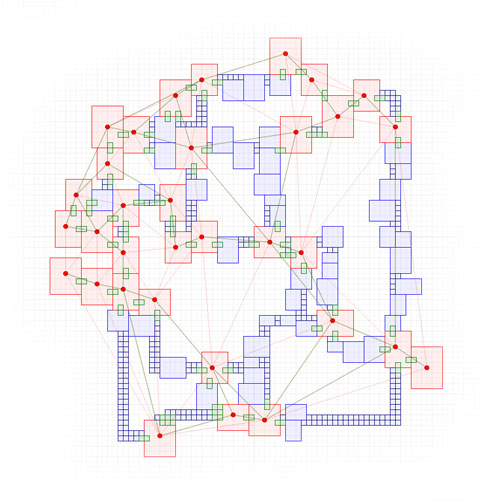
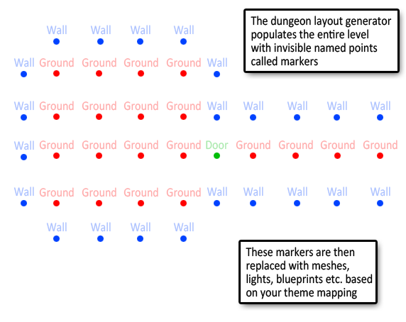

Layout Generation
-----------------
In this this phase, only the layout of the dungeon is generated in memory. No meshes or actors are actually spawned.

Next, the level is populated with invisible points called **Markers** around the generated layout.  A **marker** has only a name and a transformation in the 3D space.

In the above image, after the layout has been built, the dungeon builder has populated the level with marker points around the layout of the dungeon

