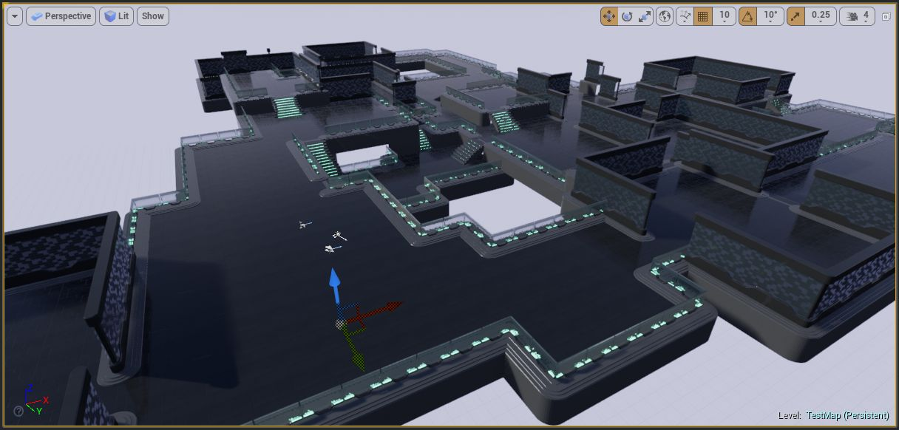

Visual Generation
-----------------
This phase spawns the actors in your scene.   It takes all the marker points inserted in the previous phase and replaces them with actors (meshes, lights, blueprints etc) that you have mapped in your theme files

The theming engine is executed for each marker inserted in the Layout generation phase.   In the above example, when a `Ground` marker is encountered, it would look for a `Ground` marker mapping in your theme file and replace the marker with the meshes you have mapped to it

The advantage of this data driven theme based approach is that theme files can be swapped to give your dungeon a completly different look.  Theme files can also be shared across mulitple projects / teams

Multiple themes can also be used within the same dungeon to create variations
