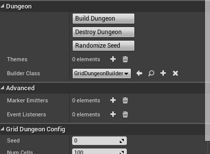

Dungeon Actor
=============
A dungeon actor is used to build your dungeons.   Drop a dungeon actor into the scene and reset its transform

The dungeon actor generate a procedural layout for your dungeon based on the various configuration paramters.  
After the layout has been generated, it spawns meshes, lights, blueprints etc, based on the mappings you have defined in the Theme file.   This way you can define what meshes needs to be attached to the floors, walls, ceilings, etc

Properties
----------
The Dungeon actor lets you perform various actions on your procedural dungeon.  Select the Dungeon Actor and have a look at the Dungeon category under the details window

**Build Dungeon:** Builds a procedural dungeon.  You need to define atleast one theme before you build

**Destroy Dungeon:** Destroys an existing dungeon owned by this actor.  If you want to rebuild a dungeon after modifying the theme, there is no need to destroy first and you can directly click build

**Randomize Seed:** A convenience function that changes the seed in the configuration.  Changing the seed would completly change the layout of your dungeon

**Builder Class:** A builder is responsible for creating the layout of your dungeon.   It contains the method and techniques to design your dungeon.    There are different types of builders available

 - Grid: Create complex dungeons with this builder.  It supports height variations, stairs, rooms and corridors
 - FloorPlan: Creates floor plans for your building interiors
 - Isaac: Creates dungeon layout similar to the game Binding of Isaac.   It also supports decorators to further beautify the layout
 - Snap: Create your modules (rooms) in separate levels and this builder generates a dungeon with these modules by stitching them together
 
**Config:** The configuration category changes based on the structure your select. Hover your mouse pointer over the various fields for more info

**Themes:** A theme file lets you design the look and feel of your dungeon.  There's an interactive editor that lets you design your own themes.  You need to specify atleast one theme file before you can build your dungeon (quick start guide comes with many pre-created themes to get you started)

**Marker Emitters:** Dungeon Architect is designed to be modular and it contains many extension points so you can plugin in your own functionality using Blueprints or C++.   Marker Emitters is one such extension point that lets you insert marker points in the scene, which your theme can later pick up replace with actors (like meshes, lights etc)

