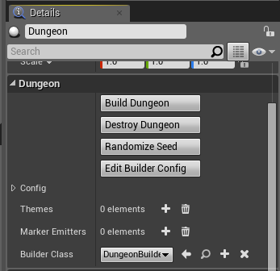

Properties
----------
The Dungeon actor lets you perform various actions on your procedural dungeon.  Select the Dungeon Actor and have a look at the Dungeon category under the details window

**Build Dungeon:** Builds a procedural dungeon.  You need to define atleast one theme before you build

**Destroy Dungeon:** Destroys an existing dungeon owned by this actor.  If you want to rebuild a dungeon after modifying the theme, there is no need to destroy first and you can directly click build

**Randomize Seed:** A convenience function that changes the seed in the configuration.  Changing the seed would completly change the layout of your dungeon

**Edit Builder Config:** If you have specified a custom builder (see below), you can customize it's exposed parameters

**Config:** The configuration structure.   Modify this to tweak the layout of your dungeon.  Detailed explanation of each field below

**Themes:** A theme file lets you design the look and feel of your dungeon.  There's an interactive editor that lets you design your own themes.  You need to specify atleast one theme file before you can build your dungeon (quick start guide comes with many pre-created themes to get you started)

**Marker Emitters:** Dungeon Architect is designed to be modular and it contains many extension points so you can plugin in your own functionality using Blueprints or C++.   Marker Emitters is one such extension point that lets you insert marker points in the scene, which your theme can later pick up replace with actors (like meshes, lights etc)
