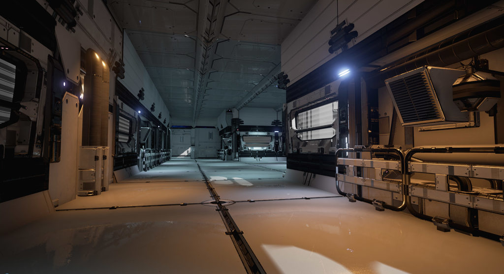
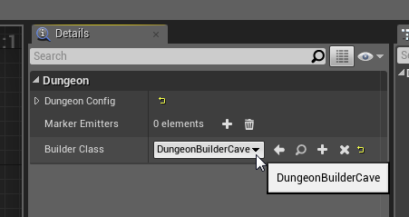

Dungeon Builders
================

A Dungeon Builder generates the layout of your dungeon.    It contains the method and techniques to design your dungeon.  There are multiple builders available and you can also create your own implementation if you wish (in blueprint or C++).  This allows Dungeon Architect to be extensible and not restricted to a single dungeon layout technique

Here we explore the various dungeon builders that ship with Dungeon Architect

Grid Builder
------------
This builder creates complex and beautiful dungeons with rooms, cooridors and height variations.

YOUTUBE(dbDak6J61zw)

###Configuration

Select the Dungeon Actor from the Details window

The various config parameters determine how the layout of the dungeon is generated procedurally.  The default layout generator algorithm is implemented based on the excellent [writeup](http://www.reddit.com/r/gamedev/comments/1dlwc4/procedural_dungeon_generation_algorithm_explained/) by TinyKeep's author Phi Dinh

The various parameters are:

* **Seed**: Changing this number would completely change the layout of the dungeon.  This is the base random number seed that is used to build the dungeon
* **Num Cells**: The number of cells to use while building the dungeon.  You will not see these cells in the final result.   A larger number would create a bigger and more complex dungeon.   A number of 100-150 builds a medium to large sized dungeon. Experiment with different ranges
* **Min/Max Cell Size**: This is how big or small a cell size can be. While generation, a cell is either converted to a room, corridor or is discarded completely.  The Cell width / height is randomly chosen within this range
* **Room Area Threshold**: If a cell size exceeds past this limit, it is converted into a room.  After cells are promoted to rooms, all rooms are connected to each other through corridors (either directly or indirectly. See spanning tree later)
* **Room Aspect Delta**: The aspect ratio of the cells (width to height ratio).  Keeping this value near 0 would create square rooms.   Bringing this close to 1 would create elongated / stretched rooms with a high width to height ratio
* **Spanning Tree Loop**:  Determines how many loops you would like to have in your dungeon.  A value near 0 will create fewer loops creating linear dungeons.   A value near 1 would create lots of loops, which would look unoriginal.  Its good to allow a few loops so a value close to zero (like 0.2 should be good)
* **Stair Connection Tolerance**: The generator would add stairs to make different areas of the dungeon accessible.  However, we do not want too many stairs. For e.g., before adding a stair in a particular elevated area, the generator would check if this area is already accessible from a nearby stair. If so, it would not add it.   This tolerance parameter determines how far to look for an existing path before we can add a stair.   Play with this parameter if you see too many stairs close to each other, or too few
* **Height Variation Probability**: Tweak this value to increase / reduce the height variations (and stairs) in your dungeon.  A value close to 0 reduces the height variation and increases as you approach 1.   Increasing this value to a higher level might create dungeons with no place for proper stair placement since there is too much height variation.   A value of 0.2 to 0.4 seems good
* **Normal Mean / Std**: The random number generator used in the dungeon generator does not use a uniform distribution.  Instead it uses a normal distribution to get higher frequency of lower values and fewer higher values (and hence fewer room cells and a lot more corridor cells). Play with these parameters for different results
* **Grid Cell Size**: The dungeon generator works on a grid based system and required modular mesh assets to be placed on each cell (floors, walls, doors etc).   This important field specifies the size of the cell to use. This size is determined by the art asset used in the dungeon theme designed by the artist.  In the demo,  we have a floor mesh that is 400x400.  The height of a floor is chosen to be 200 units as the stair mesh is 200 units high.  Hence the defaults are set to 400x400x200.   You should change this to the dimension of the modular asset your designer has created for the dungeon
* **Max Allowed Stair Height**: The number of logical floor units the dungeon height can vary. This determines how high the dungeon's height can vary (e.g. max 2 floors high).   Set this value depending on the stair meshes you designer has created. In the sample demo, there are two stair meshes, one 200 units high (1 floor) and another 400 units high (2 floors).  So the default is set to 2
* **Initial Room Radius**: Internal Usage.  Keep to a low value like 10-15
* **Floor Height**: Internal Usage. Ignored for now
* **Instanced**: Use mesh instancing for lower batch count
* **Max Build Time Per Frame**: The dungeon can be built over multiple frames so as to not hang the game (or the editor UI) while it is being built.  This value determines how much time is spent on each frame to build the dungeon.  Setting it to 0 would build the entire dungeon synchronously in a single frame.  Settting to 33ms for eg, would build it over multiple frames.  You get a callback notification when the dungeon build is complete

Floor Plan Builder
------------------
Create floor plans for your indoor buildings

YOUTUBE(K_iQH4TiVS0)

###Configuration

Select the Dungeon Actor from the Details window

* **Seed**: Changing this number would completely change the layout of the dungeon.  This is the base random number seed that is used to build the dungeon

* **Building Size**: This is the building size in logical "Grid" units.  (see grid size below).  Adjust this to change the size of your floor

* **Grid Size**: The size of a tile in the floor map.   The floor map is created in a tiled grid.   Adjust the size here based on your art assets defined in the theme file

* **Min/Max Size**: The minimum / maximum size of the room, in logical grid cooridnates

* **Hall Width**: Every room is directly or indirectly connected to a hallway.  This parameter controls the size of the hallway in grid coordinate

* **Min Room Chunk Area**: Rooms are groups together with other rooms.  However, they may be split with a hallway in between them if the combined area is greater than this value

* **Instanced**: Use mesh instancing for lower batch count

* **Max Build Time Per Frame**: The dungeon can be built over multiple frames so as to not hang the game (or the editor UI) while it is being built.  This value determines how much time is spent on each frame to build the dungeon.  Setting it to 0 would build the entire dungeon synchronously in a single frame.  Settting to 33ms for eg, would build it over multiple frames.  You get a callback notification when the dungeon build is complete

Snap Builder
------------------
Create your modules in separate levels.  Then have DA create a dungeon with those modules by stiching them together

YOUTUBE(g4IXs_ns1NY)

The designer would create a module (e.g. a room) in separate levels and assign attachment points (so other modules can connect to it).  These attachment points are called SnapDoors.  DA would them stitch them together

With this builder, the artist gets a lot more control on how each module looks.  Here are some sample modules, each in its own individual level

After you have designed a module, drop in the SnapDoor asset where an exit / entrance is expected so other modules can attach to it.  Adjust the rotation so the red arrow is aligned with the door exit

Door snap assets can be created like so:

A Snap Door has its own editor where you define how the door would look

Sometimes the door might not be connected to another module.  In this case, it's preferable to block the wall off instead of leaving an open space.   You can specify that mesh by switching the tab

Switch to your game level and register all these modules in your dungeon actor and build

###Configuration

* **Seed**: Changing this number would completely change the layout of the dungeon.  This is the base random number seed that is used to build the dungeon

* **Modules**: Here is where you register your module level assets.   DA would use these modules as building blocks to build your dungeon

* **Ignored Module Actor Type**: Since modules are designed in individual level files,  there might be actors in the module level which we don't want to be a part of the module itself (e.g. skybox, directional light, skylight, etc).    While spawning a module, DA would ignore actors of the specified types

* **Max Modules**: The no. of modules to spawn in the dungeon.  The higher the number, the bigger the dungeon

* **Collision Test Contraction**: When the modules are stitched together, DA makes sure that the newly spawned module would not overlap with any of the existing spawned module.  Setting this value to 0 would not spawn a module in locations with even the slightest overlap.  Setting to 100 units for e.g., would tolerate an overlap of 100 Unreal units

* **Max Depth**: Determines how deep a chain of modules extend before they are branched out.  Set to 0 to ignore this field.  Setting to say 10, would stitch modules linearly 10 levels deep, before it branches of into another direction from an earlier module (if it has more than 2 doors)

* **Instanced**: Use mesh instancing for lower batch count

* **Max Build Time Per Frame**: The dungeon can be built over multiple frames so as to not hang the game (or the editor UI) while it is being built.  This value determines how much time is spent on each frame to build the dungeon.  Setting it to 0 would build the entire dungeon synchronously in a single frame.  Settting to 33ms for eg, would build it over multiple frames.  You get a callback notification when the dungeon build is complete

Isaac Builder
-------------
Generates levels similar to the game Binding of Isaac

YOUTUBE(eRrh-SLcJ0A)

Theming
-------
To preview your custom builder in a theme file, open the theme in the Theme Editor and go to Properties > Dungeon

Assign your builder to the **Builder Class** property and the preview viewport should use your builder to build the preview dungeon

