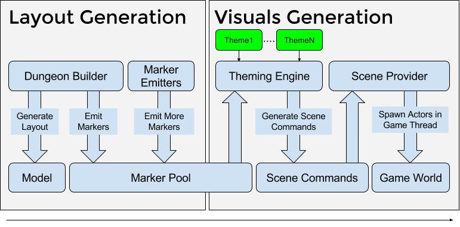

Theme Overview
==============

A theme file lets you design the look and feel of you dungeons with an intuitive graph based approach

Themes are saved as a separate assets in the Content Browser.  It also has an interactive editor to help you design beautiful levels

Create a Theme
--------------
To create a new theme, right click in the content browser and choose "Dungeon Theme"

