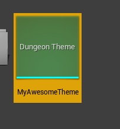
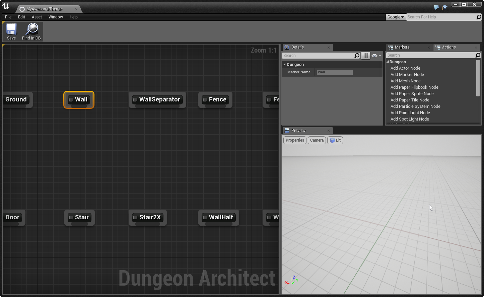
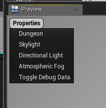
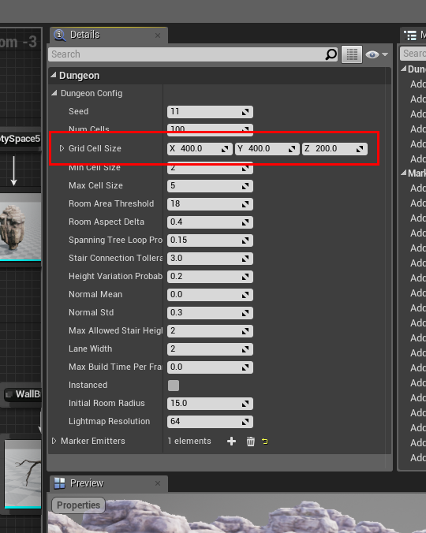
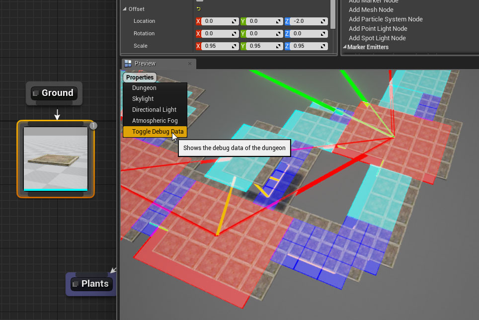
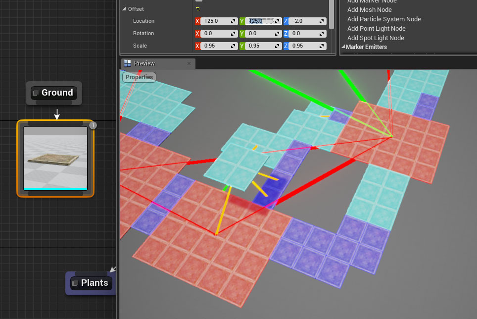

Theme Editor
============

Double click a dungeon theme asset to open it in the `Theme Editor`

Properties
----------

The Theme editor exposes various properties that lets you customize the 3D viewport

### Dungeon Property 

An important property is **Dungeon**.  Choose Dungeon from the list and the Details window will show the properties of the Dungeon actor used in the 3D viewport.  

Make sure you update the **Grid Cell Size** variable to match the dimensions of your modular assets so that the preview window can show them correctly

### Debug Draw

Turn on the Debug Drawer to align the ground mesh with the layout.  Sometimes the pivot of your ground mesh might not be in the center and you need to make sure it aligns properly with the layout so that it works nicely with other markers (Walls, Fence etc)

This example shows the ground mesh not aligned properly because the pivot of the mesh is in the corner of the mesh and is clearly visible when **Debug Draw** is turn on

A simple adjustment in the Offset variable of the ground mesh node aligns it properly

