Theme Nodes
===========

A Theme can have 3 category of nodes

* **Marker Nodes**
* **Visual Nodes**
* **Marker Emitter Nodes**

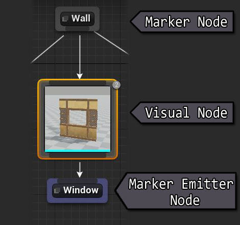

Marker Nodes
------------
After the layout generation phase, the scene would be scattered with invisible named points called **Markers**.   Then, for every marker point in the scene, the theming engine looks for a corresponding **Marker Node** with that marker name.   If found, it would start executing all the nodes defined below the marker node.

For e.g., if you have a marker node named `Ground`,  it would be invoked for every `Ground` marker found in the scene.  Once invoked, the theming engine executes all the nodes defined below it from left to right untill a certain condition is met

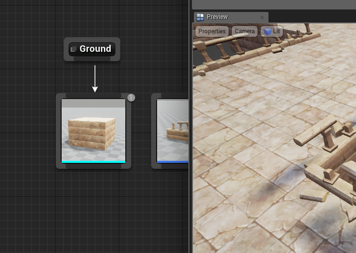

In the above example:

1. In the first phase, the layout builder has populated the map with ground markers, wherever a ground mesh was expected.  
2. Then in the next phase, the theming engine ecounters the `Ground` marker while iterating through all the markers in the scene
3. It then looks for a **Marker Node** named `Ground` in the theme graph
4. Once found, it executes the visual nodes defined below it, starting from left to right

When you create a new theme asset, the theme graph comes with a set of default marker nodes.

You can define new marker nodes and build your own hierarcy for advanced theming

Names of custom marker nodes can be changed by double clicking on them, or from the details tab

###Creating marker nodes

There are several ways to create a new marker node:

Right click anywhere in the empty area and expand the `Dungeon` category and click **Add Marker Node**
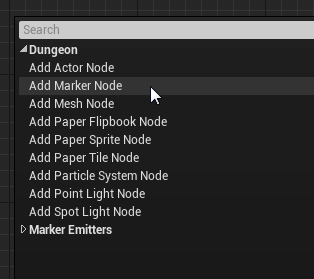

Alternatively, these context menu actions are also visible in the Actions tab. Drag and drop the **Add Marker Node** action into any empty area in the graph
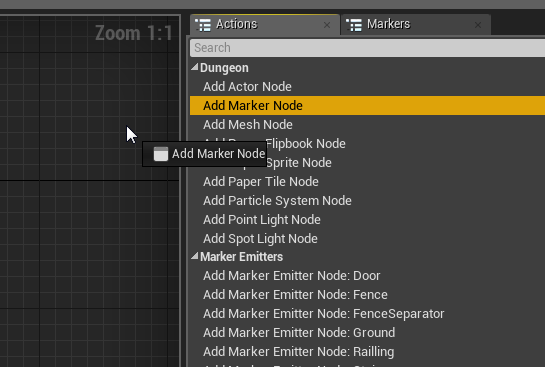

Visual Nodes
------------
Visual nodes are used for spawning actors into the scene (e.g. meshes, lights, particle systems, blueprints etc).   They are usually attached to a marker node and executed whenever an marker with that name is encountered in the scene.   When executed, it spawns an actor defined within it and places it in the scene where the marker was encountered

You can create the following visual nodes:

* **Mesh Node** - Good for spawning static meshes.
* **Point Light Node** - Spawns point lights anywhere in your dungeon
* **Spot Light Node** - Spawns spot lights
* **Particle  Node** - Spawns particle systems
* **Actor Node** - Spawn any type of actor by specifying it's class

If you have the Dungeon Architect Paper2D extension installed, then you can spawn additional visual nodes

* **Paper Sprite Node** - Good for spawning individual sprites
* **Paper Flipbook Node** - Spawn animated sprites
* **Paper Tile Node** - Spawn tiles extracted from a Paper2D tilemap.  The editor gives you a user-friendly UI to select the tile from the tilemap

###Creating visual nodes

There are several ways to create a new visual node:

Drag a link out of the marker node you intend to attach it on and select the appropriate visual node you desire
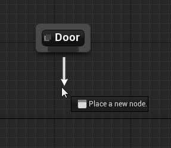

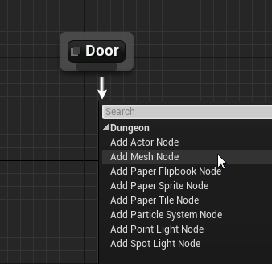

Alternatively, right click anywhere in the empty area and expand the `Dungeon` category and choose a visual node to create

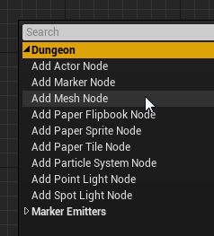

Alternatively, these context menu actions are also visible in the Actions tab. Drag and drop visual node action into any empty area in the graph
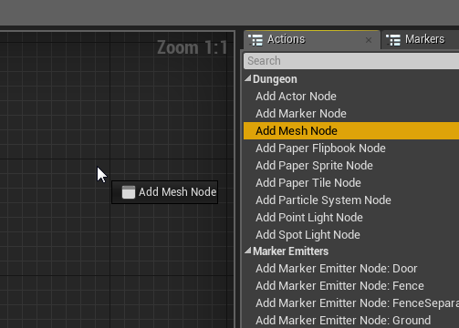

Marker Emitter Nodes
--------------------
Marker Emitters emit new markers into the scene.  These nodes are attached to visual nodes and if the parent visual node is executed, it would insert a named marker into the scene.

**Marker Emitter** nodes are similar in apperarance to Marker Nodes.  However, they are purple in color and have an input pin, instead of an output pin

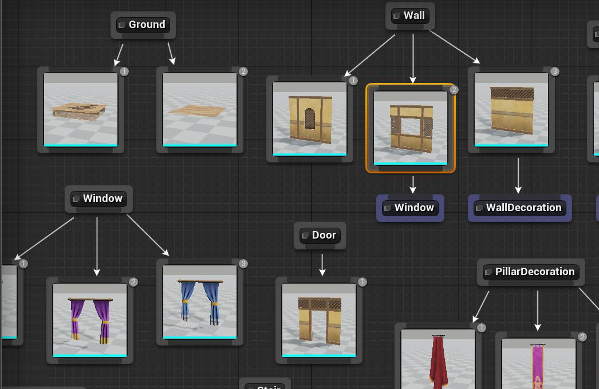

In the above example,  the `Wall` Marker has 3 Mesh nodes attached to it with probability such that any one for the 3 would be randomly chosen.   
One of the 3 meshes has a window in it and we would like to decorate that mesh with curtains, but only if that node is selected.    So, we define a new Marker named `Window` (can be any name) and attach curtain meshes to it.
Then we **emit** a Window Marker Node from the desired visual node.   Hence, if the mesh in the middle is executed, it would also insert a marker named *Window* in its position.   Then the theming engine would execute everything beneath the `Window` marker and pick a random curtain and attach to the wall

This ability of defining your own hierarchy lets you design powerful themes for your levels

###Creating marker emitter nodes
To create a **Marker Emitter** Node, drag a link out of a visual node and select a marker name you would like to emit

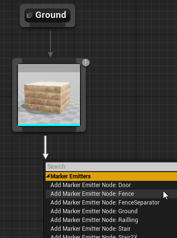

Alternatively, right click anywhere in the empty area and expand the `Marker Emitters` category and click choose a marker to emit

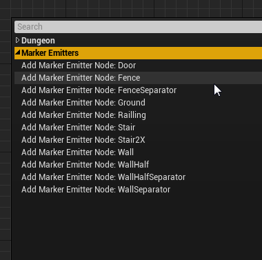

Alternatively, these context menu actions are also visible in the Actions tab. Drag and drop visual node action into any empty area in the graph

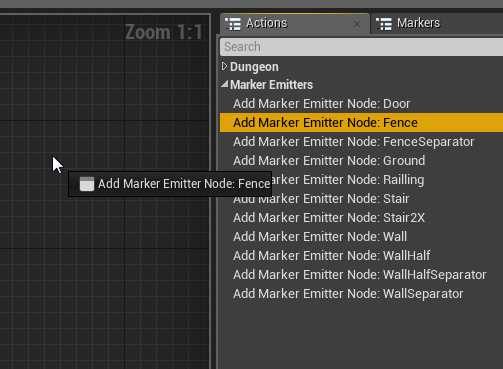

###Cycles

Cycles are not allowed when you emit markers as it doesn't make sense to continuously emit markers in an infinite loop

The editor takes care of not allowing cycles and notifies you with a user-friendly message when you attempt to create a connection with a marker emitter that might cause a loop

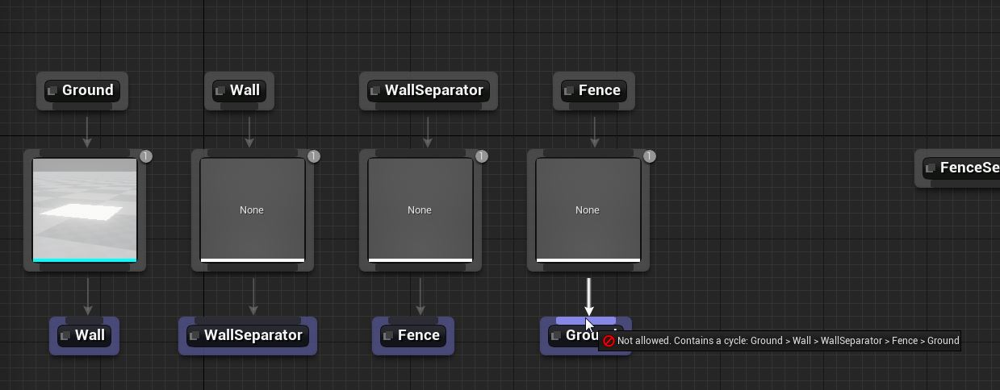

