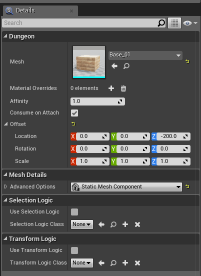

Theme Node Properties
=====================

A node in the theme graph can be customized from the Details Tab

Visual Nodes
------------
Select a visual node (e.g. a mesh node) and have a look at the details tab:

The properties that are common to all Visual nodes (Mesh, Blueprints, Lights, Particle, Sprite etc) are explained below:

**Affinity:**  This is the probability of attachment.  When this node is executed, the theming engine looks at this variable and rolls a dice and decides whether to insert this visual object into the scene or not.  If this value is 1.0, then it would insert it 100% of the time.  If the value is 0, then it would not insert it since selection probabiliyt 0%.  If it is 0.5, then it would insert it 50% of the time

**Consume on Attach:** If the visual object was indeed spawned into the scene (based on the probability above), the theming engine would then look at this flag to decide if we need to execute the next sibling node.  If it is checked, then execution stops for this marker.  If it is unchecked, the next sibling gets processed.  *Affinity* and *Consume on Attach* can be combined to create interesting possiblities in your theme

**Offset:** Apply transformation offset to your visual object relative to the marker location.  This is a very useful property while designing your theme.   If the pivot of the mesh your artist has designed isn't where you wish it were, you can easily adjust it here to translate / rotate it around.  You can also scale objects if they are too small / big.  While designing your theme, you might be using this useful property to re-position your visual nodes, if required.

**Selection Logic:** Lets you define selection logic blueprints.  You have seen an example above of node selected based on random probability (Affinity property).   The selection process can be far more power than a simple random probability based selection.  You can define you own blueprints and assign it here so you blueprint logic could decide if a node is to be selected or not.  More details below

**Transform Logic:** In the Offset property as seen above, you can define a static offset transformation to move/scale/rotate the visual object from the marker position.  With Transform Logic, you can define blueprint based transformation where you can provide dynamic tranform offsets based on a logic.  For e.g., you might want to rotate/scale/translate a tree randomly to give natural variation instead of having them all face the same direction.  More on this later

### Mesh Node

### Point Light Node

### Spot Light Node

### Particle Node

### Actor Class Node

Marker Node
-----------

Marker Emitter Node
-------------------
