Paint Mode
==========

Dungeon Architect also allows you to paint your own dungeon layouts with a special editor mode.  This gives you more artistic control as you are no longer restricted by what the procedural algorithm creates

To Activate the Paint Editor mode and start painting, Switch to the *Dungeon Paint* Tab

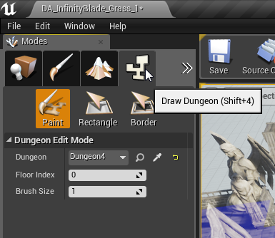

As soon as you switch to the Paint Mode, the viewport shows the layout of your dungeon in Blue

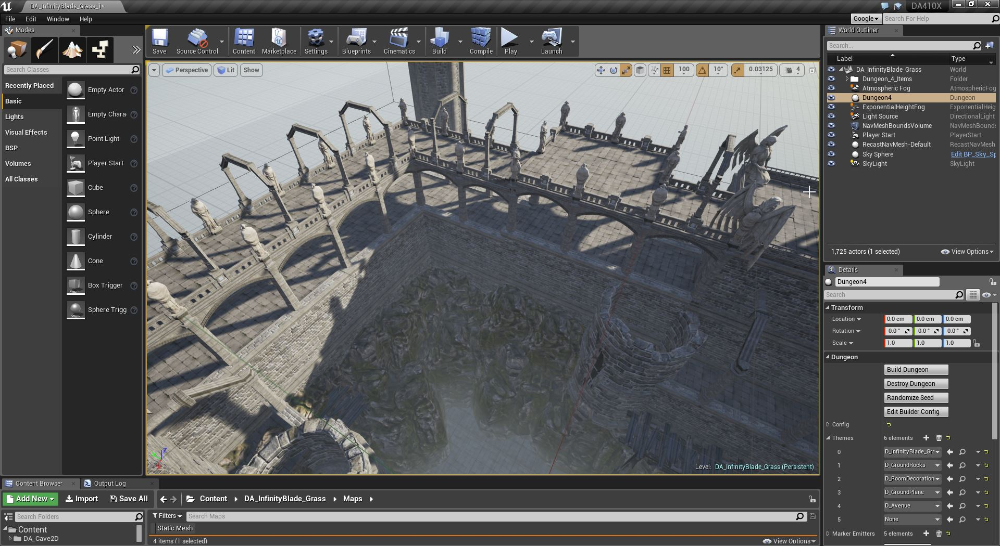

There are various tools you could use to paint your dungeons

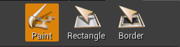

Paint Tool
----------
The paint tool allows you to paint at different heights.  Custom painted blocks are Cyan in color

Paint by holding *Left click*

Delete a painted block by *Shift + Left Click*

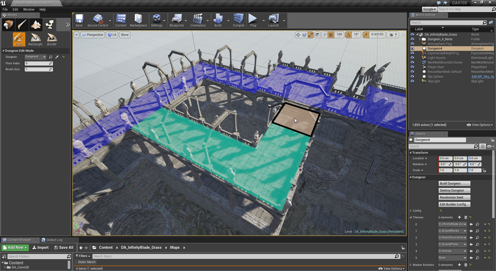
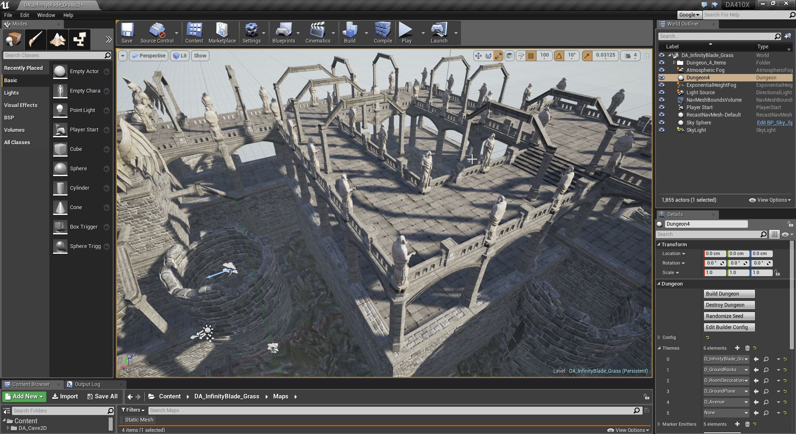

You can adjust the size of the paint brush and change the logical floor height you would like to paint on

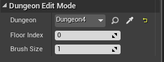

Rectangle Tool
--------------

The rectangle tool lets you cover larger areas.  Hold and drag to draw a rectangle. Release to commit the changes. Custom painted blocks are Cyan in color

Paint by holding *Left click*

Delete a painted block by *Shift + Left Click*

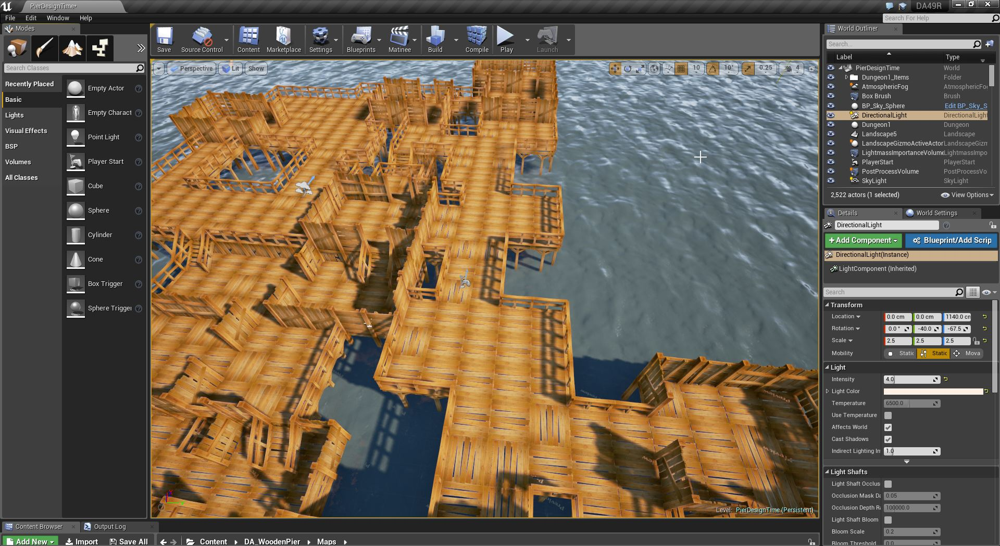
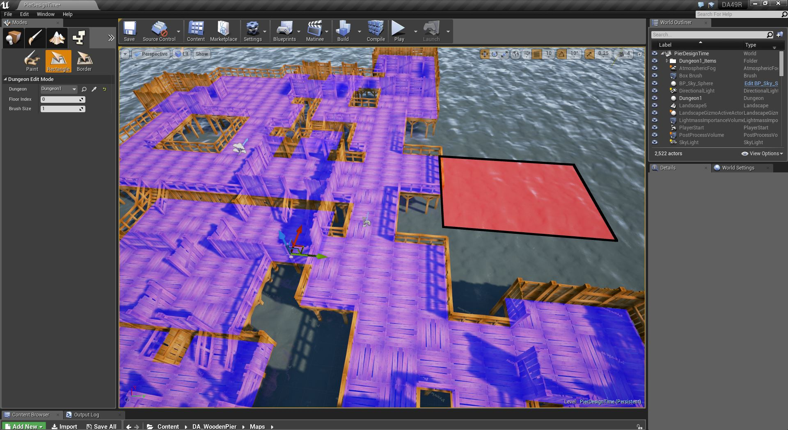
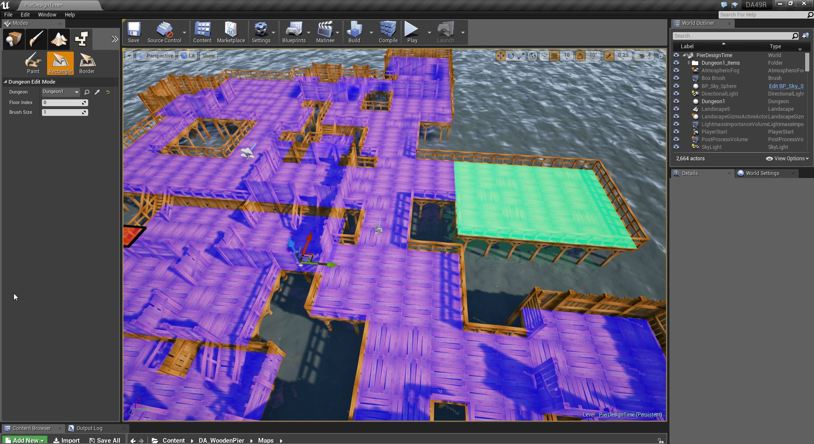
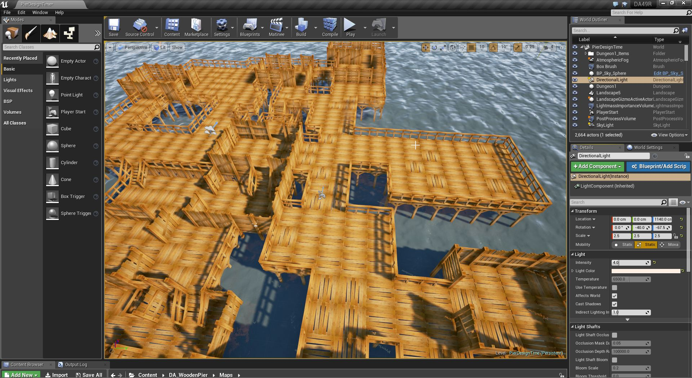

Border Tool
-----------

The border tool works similar to the Rectangle tool, paints along the border of the rectangle layed down by the user.

Hold and drag to draw a rectangle. Release to commit the changes. Custom painted blocks are Cyan in color

The thickness of the border can be adjusted with the Brush Size property

You can paint in different height by changing the *Floor Index* property

Paint by holding *Left click*

Delete a painted block by *Shift + Left Click*

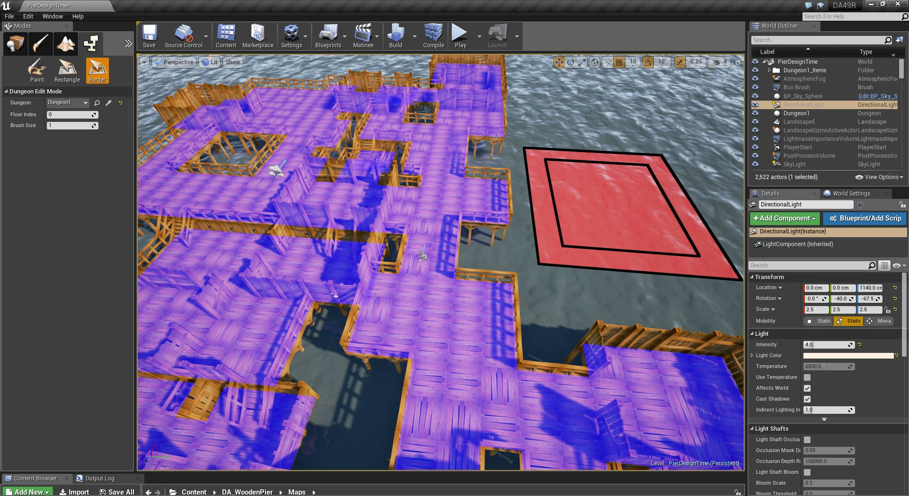
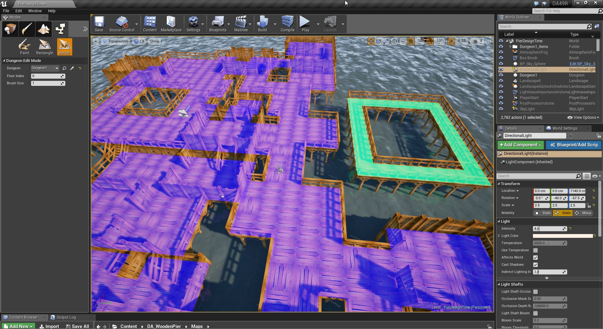
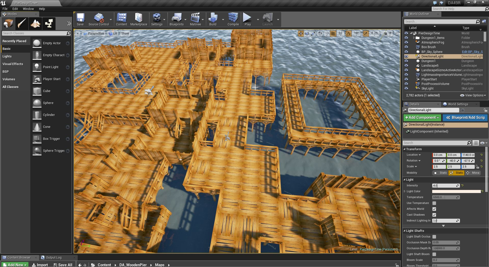
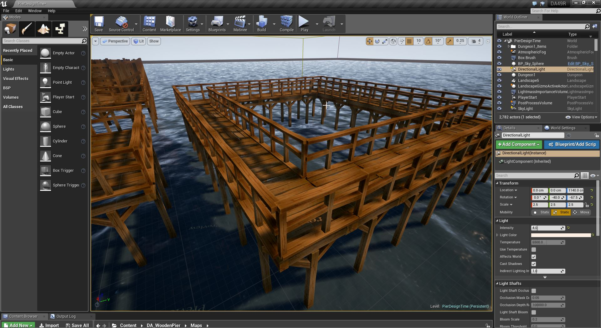

Manual Painting
---------------

If you do not want any procedural content to be generated when you paint your level, then set the **Num Cells** property to `0` in your Dungeon Actor's Configuration section

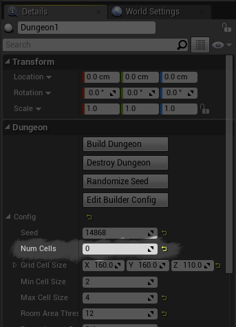

This way the dungeon would have an empty layout, allowing you to paint from scratch

If you do want procedural content but want to remove certain procedural areas that are getting in your way, then use a *Negation Volume*
