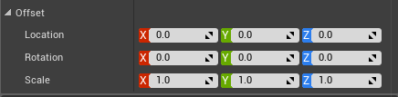
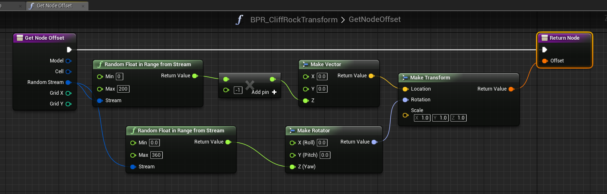
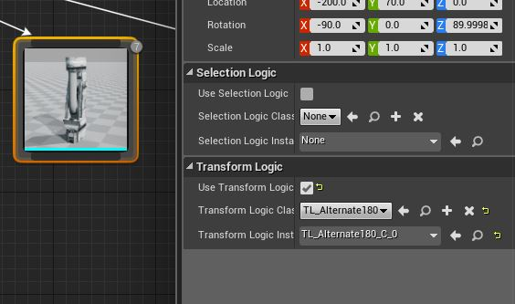

Rules
=====

You can attach Blueprint (or C++) based logic on the theme nodes for more control. There are two types of rules you can attach to Visual nodes

Selection Rule
--------------
A selection rule is a blueprint class (or C++ class) that is used to decide if the current node is to be attached to the scene.  This rule replaces the default **Affinity** property that is used for randomly deciding if visual node needs spawning based on a probability.

Selection rules gives you more power, when you need it.   In the rule's blueprint logic, you can query the dungeon model and determin if this node should be inserted into the scene

###Using Selection Rules
To assing an existing rule into the node, Check the **Use Selection Logic** property and select the rule you would like to attach to the node from the dropdown list

You can create new rules by clicking the **+** sign and choosing a path to save you blueprint node

Give your blueprint rule a name and save it somewhere

Open up the blueprint and override the **Select Node** function. This function will be called by the engine and the logic you put here will let you decide if the node should to be selected

### Example #1

Here is an example of a selection logic that selects a node only if the sum of their X and Y positions are even numbers (logic for a checkerboard pattern)

And the result after applying this rule to the ground node:

You can add more visual nodes and experiment with the **Consume on Attach** parameter to get interesting results

In the above example, the first node has **Consume on Attach** checked.  So if your blueprint logic selects the node, the sandstone mesh will be inserted and the execution stops.   However if the selection node doesn't select the node, the execution will always proceed to the next node and execute the mesh which inserts a clay brick mesh

In the above example, the selection rule is applied to the golden pillar.  But whenever it is selected, it stops execution because the **Consume on Attach** variable is set and doesn't build a ground mesh there.    Unchecking **Consume on Attach** on the first node lets the execution proceed even if it is inserted into the scene

### Example #2
This example places a stone mesh on the ground, but only if the cell is inside a room (and not a corridor)

The above Selection logic was attached to the stone mesh ground node so it gets selected only when the ground marker is inside a room

Transform Rule
--------------

Dungeon Architect lets you specify offsets to your visual nodes to move/scale/rotate them from their relative marker locations.

However, if you want a more dynamic way of applying offsets (based on blueprint or C++ logic), you can do so with a *Transform Rule*.  This can be very useful to add variations to your levels for certain props

###Using Transform Rules
To assing an existing rule into the node, Check the **Use Transform Logic** property and select the rule you would like to attach to the node from the dropdown list

You can create new rules by clicking the **+** sign and choosing a path to save you blueprint node

Give your blueprint rule a name and save it somewhere

Open up the blueprint and override the **Get Node Offset** function. This function will be called by the engine and the logic you put here will let you decide on the offset that needs to be applied on this node

###Example #1

In this example, a single rock mesh is randomly rotated, and slightly scaled and translated to give a nice cave like look

A different transformation rule is applied to ceiling stone meshes for more variations

###Example #2

Here is an example where alternate pipes are rotated by 180 degrees to give a visually appealing look

This was done by rotating the mesh node by 180 degrees for every alternate cell (similar to the checker rule logic seen previously)

###Example #3

In this example a small random rotation is applied to orange ground tiles.  Useful while creating ruins when laying down broken tile meshes

