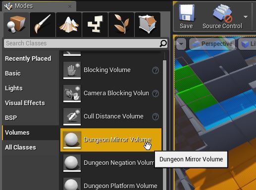

Volumes
=======

Dungeon Architect provides various volumes to help you influence your dungeon as per your requirements.

Platform Volume
---------------

Place a platform volume anywhere in the scene and Dungeon Architect would adjust the dungeon layout and create a platform (room or corridor) at that location.  Scale the volume along the XY plane to change the size of the generated platform.   You can move the platform volume with the move tool to the desired location. (Rotation is not supported)

This gives you artistic control and lets you manipulate the dungeon to suit your needs

Here is an example of a user generated layout using volumes leading up to a boss fight

To place a platform volume,  go to Volumes tab and drag and drop it into the scene

Select the platform volume and have a look at it's properties

The Volume needs to know which dungeon the volume belongs to (DA Supports mulitple dungeons within the same scene). Select the dungeon you have in your scene.

Relatime Update flag updates the dungeon as you move/scale the platform volume, giving you interactive feedback.  Uncheck if you face performance issues (Or, build the dungeon over multiple frames without stalling the UI by setting the Dungeon actor config propery's field *MaxBuildTimePerFrameMs* to around 20 to 30)

An example of a corridor segment created using a platform volume.  Notice how the platform nicely blends with the existing geometry if it comes in contact with it

Rooms always connect to atleast one other room in the dungeon.  Changing the Cell type to *Room* creates this result

Theme Override Volume
---------------------
Give certain areas of you dungeons a different look and feel.   Layout inside this volume would use the theme defined by this volume.  

This is useful for adding variations to your level

The **Reversed** flag, if checked, overrides the theme of everything outside of the volume (as opposed to inside)

**Realtime Update** updates the dungeon as it is moved or scaled giving your immediate visual feedback

Note: When overriding, the themes needs to be designed for the same grid cell size for proper results

Negation Volume
---------------
This volume removes all procedural geometry inside of this volume.  Use this to get rid of procedural geometry in areas you do not need or when it is getting in the way while manually painting your layout

The **Reversed** flag, if checked, removes all the procedural layout outside of the volume (as opposed to inside)

**Realtime Update** updates the dungeon as it is moved or scaled giving your immediate visual feedback

Mirror Volume
-------------
Mirror Volumes lets you create symmetric dungeon by mirroring the layout of a dungeon

This is useful when you need symmetry in your maps (e.g. strategy games)

To create a Mirror Volume, drag it from the volumes tab:

Place the volume where you would like to have the layout mirrored.  The mirroring would happen along the local X-axis of the volume.  You can rotate the volume in steps of 90 degrees (0, 90, 180, 270) to mirror in different directions

Multiple mirrors can also be placed within the same dungeon

Example of procedural maps created for a 2-player twin stick RTS game

