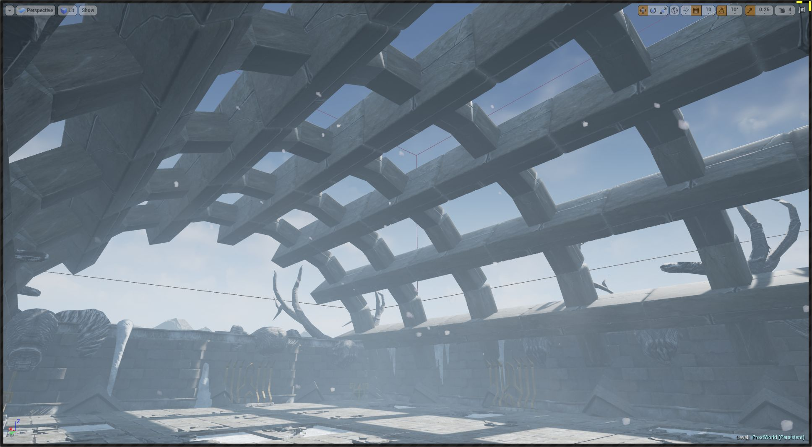

Marker Emitters
===============

Marker Emitters are blueprint scripts (or C++) that lets you emit your own markers anywhere in the map

As seen previously, *Markers* are emitted by the Dungeon Builder class around the layout of the dungeon (e.g. Wall, Ground, Fence etc) and you can insert actors at that location from the Theme graph.  You can even create your own markers emitted off of those parent markers, but without *Marker Emitters* you are restricted to the starting markers the dungeon builder has initially emitted for you

Marker Emitters gives you a lot of flexibility and you can query the dungeon model and emit markers anywhere in the map

A Marker Emitter is invoked right after the Dungeon Builder emits all the markers for the dungeon (Ground, Wall etc)

Creating a Marker Emitter
-------------------------

Add an existing marker emitter by selecting the Dungeon Actor and navigating to the Details tab

You can create new marker emitter blueprint scripts by clicking the **+** icon next to the Marker Emitter name

Start placing your logic in the blueprint by overriding the **Emit Markers** function

This method is invoked by the engine and lets you emit as many markers as you like into the scene with any transforms.

To emit a marker, create a *Emit Marker* node

You can emit as many markers as you like

Theme Preview
-------------

If you want to preview your marker emitter logic in the Theme Editor's 3D Preview viewport,  you can set it up like this:

Navigate to the theme editor's 3D Viewport > Properties > Dungeon

This will open up the dungeon properties. Add your marker emitter there and the preview viewport will pick up the markers emitted by your Marker Emitter blueprint script and show it in the preview viewport

Example #1
----------

This marker emitter queries the dungeon model and emits a marker at the center of all the rooms

Example #2
----------

The *Hell Forge* demo has a good looking cave like system generated using Marker Emitters.

Since the rocks for the cave walls cannot be inserted in the Wall and Fence markers (as they are big and would block the passage), we need to find positions in the empty space that are further away from the walls and fences

This is done with a marker emitter blueprint `DA_InfinityBlade_Fire/Dungeons/Rules/MarkerEmitter/BPM_AdjacentCellEmitter`

The Hell Forge theme applies rocks to these markers (EmptySpaceN) and increases their scale as they move further away from the the ground

This gives a nice progressive elevation to the mountains giving the impression that the pathways are naturally formed

Example #3
----------

Heres another example of a curved roof created over a room using marker emitters

