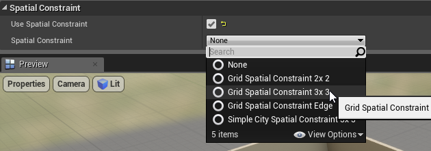

Spatial Constraints
===================
Spatial constraints are great of checking the state of nearby tiles and using it as a condition to place items on the scene

Spatial constraints are set in the theme graph's node.   

In the above example, a statue mesh is added to the ground marker.    We want this to appear only on the corners and not on each tile

Select a mesh node and in the details panel, enable *Use Spatial Constraint*

Then select the spatial constraint type.  Since this is a ground mesh, it is surrounded by 3x3 tiles

Expand the spatial setup. Here you specify the rules of the adjacent tiles, whether it should be empty, occupied or should be ignored.   The rules will try to rotate to best fit the layout

With this setup, the statues spawn only at the corners
