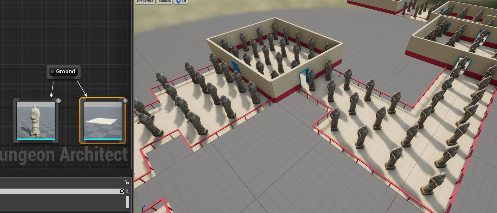

Spatial Constraints
===================

Nearby tiles can be used as a condition for placing objects on the scene using spatial constraints

Spatial constraints are defined in the theme graph's node.   Select a mesh node and in the details panel, enable *Use Spatial Constraint*
