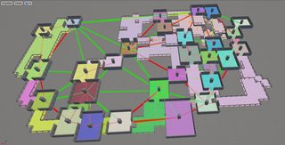

Clustered Theming
=================

Clustered theming allows you to automatically apply different themes to various parts (clusters) of your dungeons. This helps in adding variation to your levels and break monotony

A continous section of corridor cells or rooms are assigned to a clusters to have a proper theme transtions 

## Using Clustered Theming

To use clustered theming, enable it from the dungeon's detail panel

Once enabled, you need to define a list of theme sets you'd like to apply on the clusters from the Advanced category of the dungeon's detail panel

**IMPORTANT:** When you use clustered themes, the **dungeon's default theme array list will be ignored** and the theme list defined in the cluster themes mapping would be used instead

Currently, only the grid builder supports clustered theming

## Height Variations

Corridor cells connected together are grouped into a cluster.   You can customize if connected nearby corridor cells on different height (connected through stairs) should be grouped into the same cluster

 

Notice the corridor on the bottom right.  It was split into two themes because of the height variation

