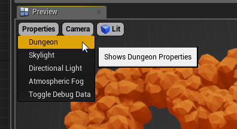

Dungeon Builders
================
The Default dungeon builder used to create the layout is swappable and you can provide your own implementation, as a blueprint script or in C++.

This is useful if you want to use your own algorithm for generating the layout of your dungeons.  

You are not limited to a grid based system.  Here are some examples of custom builders

Using a different Builder
-------------------------

To use a different builder to create your dungeon layout, Select the dungeon actor and choose the desired builder class

Creating a new Builder
----------------------

To create a builder, select a Dungeon Actor, and navigate to the Details window

Click the **+** icon next to the Builder Class property and save the Blueprint 

Open the Builder blueprint and override the function **Emit Dungeon Markers**

Build your layout and emit markers using the **Emit Marker** node

Specify the marker name in the SocketType field

These marker names will be used in the theme files

Note: Builders are very low level and you need to emit markers for grounds, walls, doors etc yourself wherever needed.   It gives you a lot of power but you need to put in the work to emit the base markers yourself.  If you want to build on an existing layout (like the default grid based builder) try *Marker Emitters* instead.

Theming
-------

To preview your custom builder in a theme file, open the theme in the Theme Editor and go to Properties > Dungeon

Assign your builder to the **Builder Class** property and the preview viewport should use your builder to build the preview dungeon

