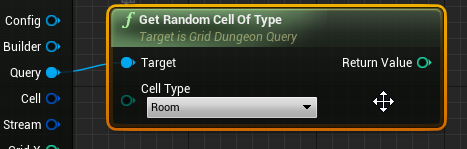

Query Interface
===============

The query interface has various helper functions to query the structure of the dungeon.    You can use the query interface in your selector / transform logics or marker emitters for more control

Each builder implements its own query interface.    

##Access the Query Interface
You can access the query interface from different places

---

---

---

---

##Grid Query Interface

The Grid Query Interface lets you query the structure of a grid builder based dungeon

###Get Cells

Gets a list of all the Cell IDs in the dungeon. A corridor patch or a room is a cell. A cell is always rectangular in shape, with a center and size

###Get Cells Of Type
Similar to Get Cells function but filters the cells based on a type (Room, Coordor)

###Get Cell Dimension
Gets the dimension of a cell.  This takes in a cell id and will return the center and the size of the cell

###Get Path Between Cells
Gets a valid path between any two cell points.  This can be used to create waypoints in your game.  There is an example in the quick start guide demonstrating this

###Get Furthest Rooms
Find the furthest rooms in the dungeon.   This function returns two cell ID.  This can be useful for setting the start / end rooms (or spawn / boss rooms)

### Get Cell At Location
Pass in a world location and get the cell id.  This is useful for finding the cell an actor is in.   For e.g., if you'd like to check if all NPCs in a room are dead before unlocking a door, you would iterate through all the actors and check if they are in the same room the player is in

### Get Cell Type
Find the type of the cell (Room, corridor).    There is another category called CorridorPadding, which should also be considered a Corridor

### Get Random Cell
Gets a random cell from the dungeon.  

There also a version that takes in a random stream. You should use the random stream version if you want to guarantee the same dungeon for a particular configuration. The dungeon's random stream is access from within the selector and transform rules

### Get Random Cell Of Type
Gets a random cell of a particular type from the dungeon.  

There also a version that takes in a random stream. You should use the random stream version if you want to guarantee the same dungeon for a particular configuration. The dungeon's random stream is access from within the selector and transform rules

### Contains Stair Between

Check if there is a stair connecting the two input cells

### Contains Door Between

Check if there is a door connecting the two input cells

### Get Stair Between

Get the stair information between the two input cells

### Get Opening Point Between Adjacent Cells

When two cells are adjacent to each other, there might be a constraint on how we can traverse through them. There might be a height variation, or there might be a wall between the cells.  In that case, the only valid way to move across is through the stair or a door repectively.   This function calculates and returns the correct world position.  This position lies in the edge of the two cells.  If there is no barrier between the two cells (doors / stairs) a point in the center of the edge is returned

This function is used in the path demo to correctly place the spline through the doors and stairs

### Get Adjacent Cells On Edge

You can use this function in a selector logic of a marker that is on the edge (e.g. Walls / Fence).   This function returns the cells adjacent to the marker.   You can use it to decorate your walls / fence selectively. E.g. do no spawn lights on walls of an empty side, or have a different art style when a wall is shared by two rooms

### Is Near Marker

The function returns true if a marker with the specified name is found nearby.    You specify the distance to search and the marker name. 

This function is useful if you don't want to place blocking items near doors / stairs.

