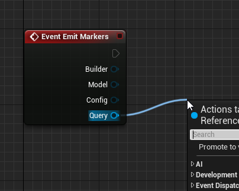
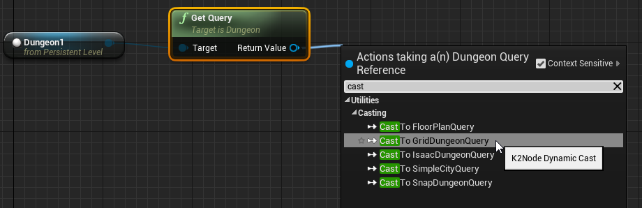

Query Interface
===============

The query interface has various helper functions to query the structure of the dungeon.    You can use the query interface in your selector / transform logics or marker emitters for more control

Each builder implements its own query interface.    

##Access the Query Interface
You can access the query interface from different places

---

---

---

---

##Grid Query Interface

###Get Cells

Gets a list of all the Cell IDs in the dungeon. A corridor patch or a room is a cell. A cell is always rectangular in shape, with a center and size

###Get Cells Of Type
Similar to Get Cells function but filters the cells based on a type (Room, Coordor)

###Get Cell Dimension
Gets the dimension of a cell.  This takes in a cell id and will return the center and the size of the cell

###Get Path Between Cells
Gets a valid path between any two cell points.  This can be used to create waypoints in your game.  There is an example in the quick start guide demonstrating this

###Get Furthest Rooms
Find the furthest rooms in the dungeon.   This function returns two cell ID.  This can be useful for setting the start / end rooms (or spawn / boss rooms)

### Get Cell At Location
Pass in a world location and get the cell id.  This is useful for finding the cell an actor is in.   For e.g., if you'd like to check if all NPCs in a room are dead before unlocking a door, you would iterate through all the actors and check if they are in the same room the player is in

### GetCellType

### GetRandomCell

### GetRandomCellOfType

### ContainsStairBetween

### ContainsDoorBetween

### GetStairBetween

### GetOpeningPointBetweenAdjacentCells

### GetAdjacentCellsOnEdge

### IsNearMarker

