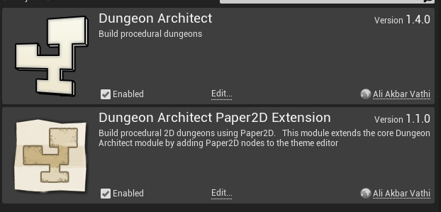
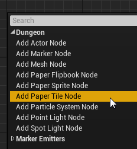
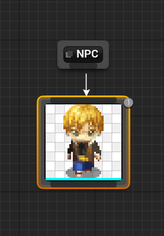
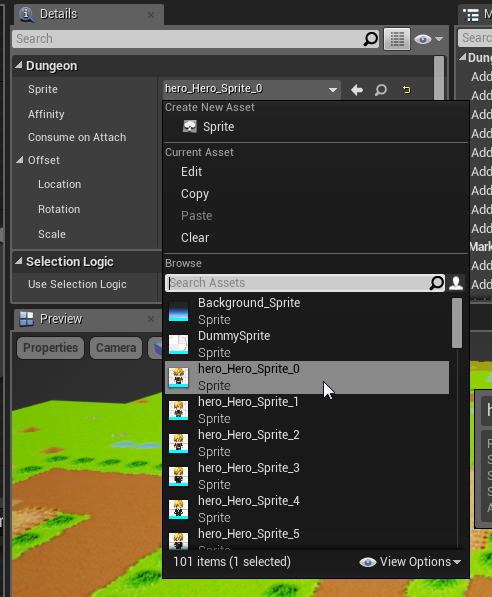
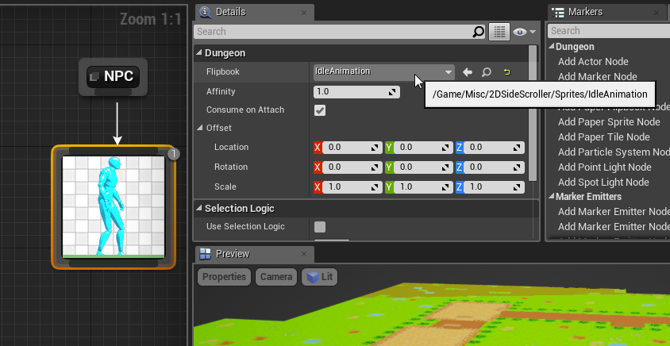
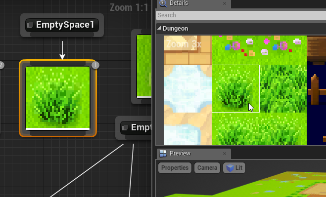
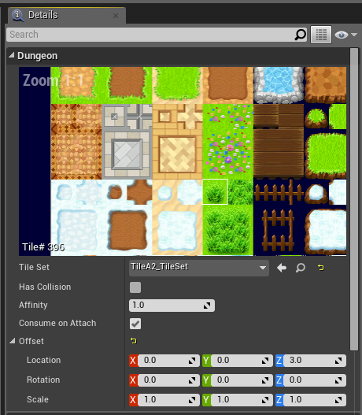
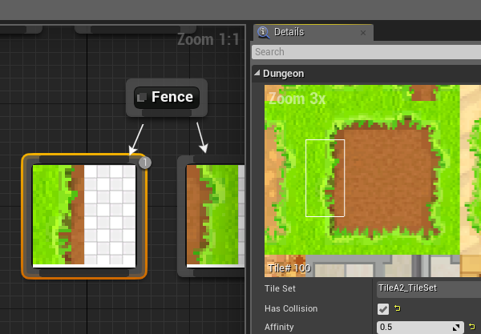

Paper 2D Extension
==================

Adds Paper2D support for your 2D games.  This extension plugin extends the core DungeonArchitect module by adding Paper2D support to the theme editor and builder

The decision to turn this into a separate module (instead of having it in the core module) was to avoid having to link to Paper2D

Theme Nodes
-----------

This module extends the Theme Editor with new 2D nodes that work well with the Paper2D plugin

### Sprite Node

Place static sprites in the scene with this node.

Create a sprite node and specify the sprite your need from the details window

### Flipbook Node

Place animated sprites in the scene with this node.

Set the flipbook animation to use in the details window

### Tile Node

Select a tile from your tileset to place in the scene.  This is a very useful node as it lets you theme your level with a tileset.

Set the tileset you intend to use.  Once selected, the details window lets you pick a tile from the tileset

You can pick tiles of any dimension (e.g. 3x5) and are not restricted to a 1x1 selection

This is very useful if you have art spanning multiple tiles (e.g. trees)
