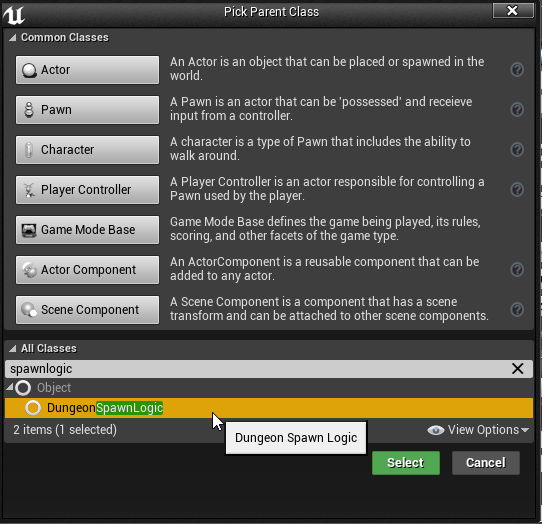
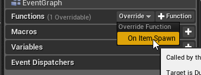
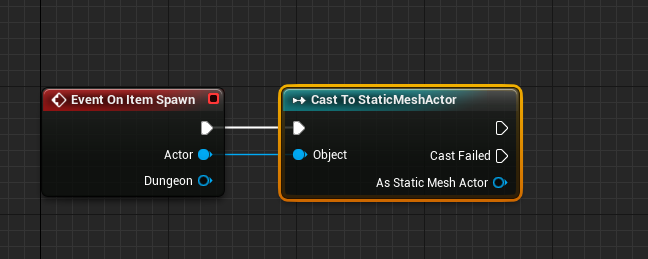
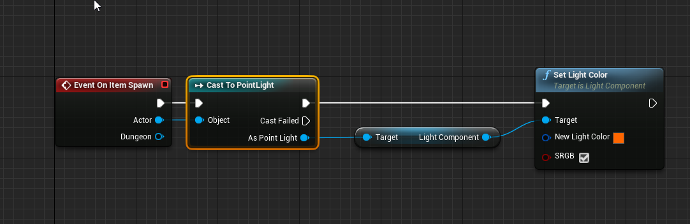

Spawn Logic
===========

Spawn Logics are blueprints that are attached to visual nodes and are executed whenever that visual item (mesh, actor, particle system, light etc) is spawned into the scene

These are great for initializing blueprints (or randomizing them). Some use cases include randomizing the colors of the lights that spawn from a light node, or you can use it to initialize your blueprints spawned from the actor nodes

You can attach a spawn logic to any visual node (e.g. mesh node, light node, particle system node, actor node etc)

Set the *Use Spawn Logic* flag and choose your spawn logic blueprint

##Create Spawn Logic

Create a new blueprint class and pick DungeonSpawnLogic class as the parent

##Define Spawn Logic

Open your blueprint and override the *OnItemSpawn* function.   

Get the reference of the spawn actor and cast it to the type you are expecting.  Since this logic was attached to a mesh node,  it is cast to a static mesh and customizations can be applied to it 

Another blueprint that was attached to a point light.  Since we expect a point light, we cast to the correct type and change the color

