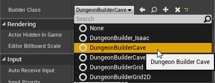
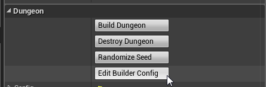
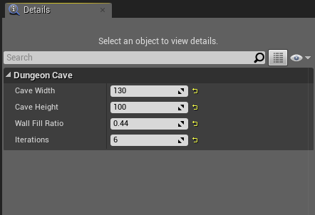
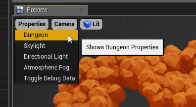
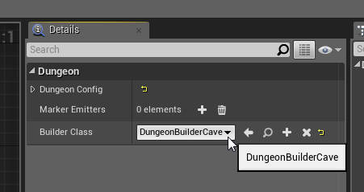
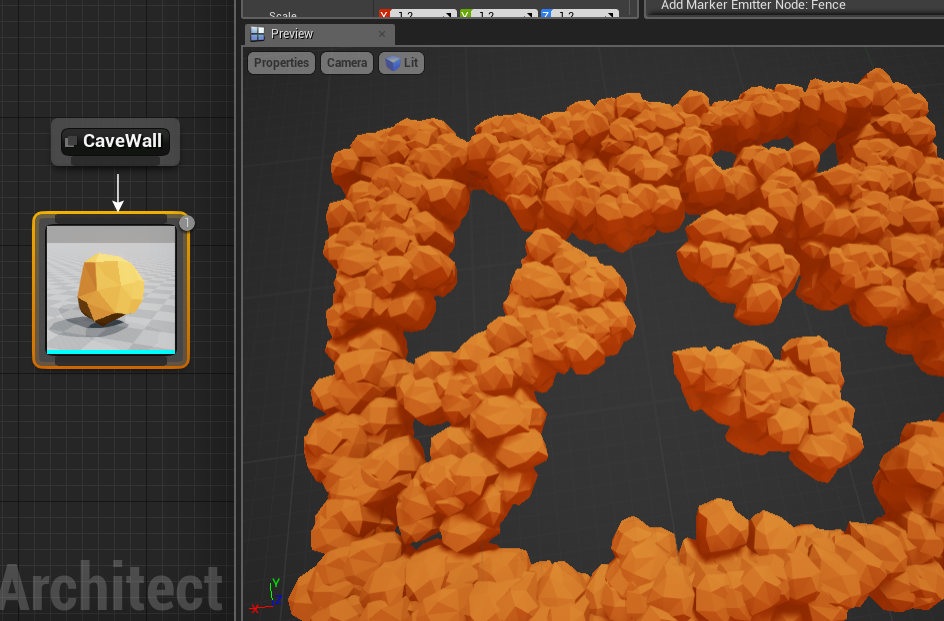
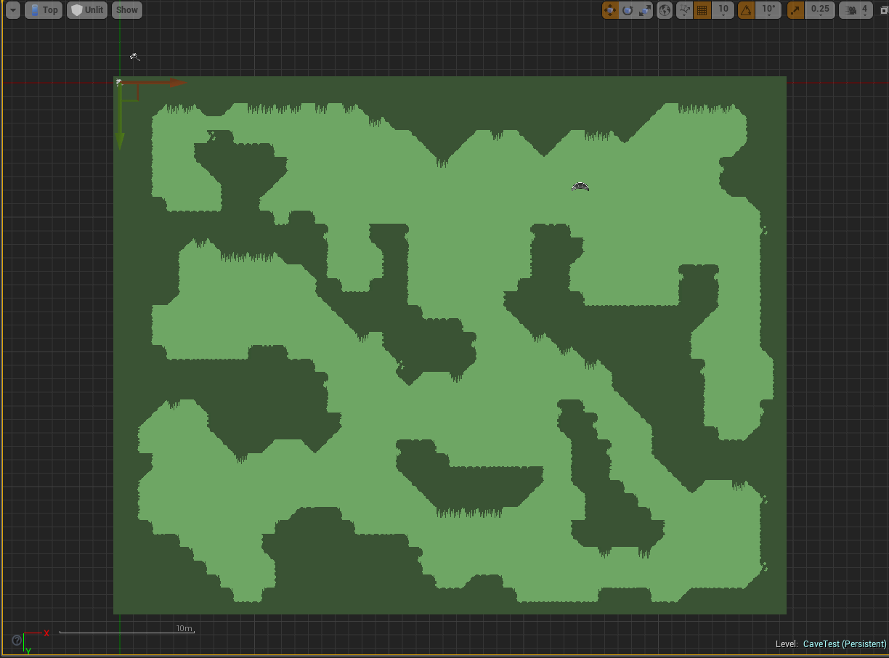
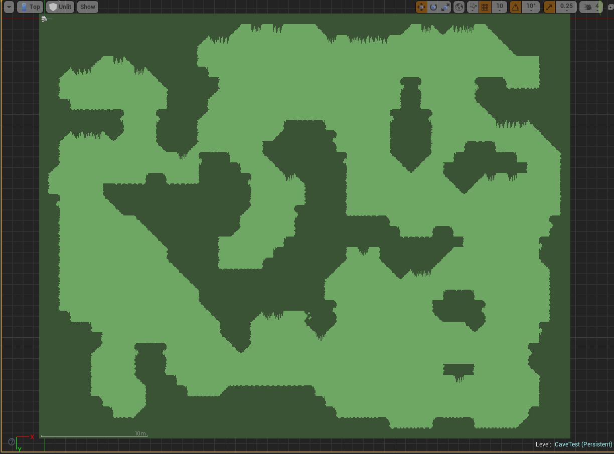
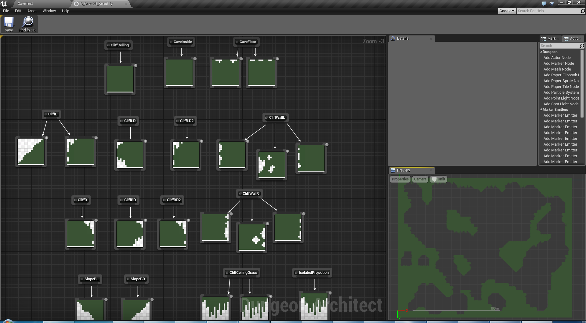

Cave Builder
============

**Experimental** - Note: This feature is still experimental and not fully supported

This implementation of a Dungeon Builder uses [Cellular Automata](http://www.roguebasin.com/index.php?title=Cellular_Automata_Method_for_Generating_Random_Cave-Like_Levels) to build cave like structures

The builder is implemented in C++ and available here:

`Plugins/DungeonArchitect/Source/DungeonArchitectRuntime/Classes/Dungeon/Builders/DungeonBuilderCave.h`

Using the builder
-----------------
Have a look at the Quick start sample folder `DA_Cave_SideScroll` for examples

To use the builder, select your dungeon and choose `DungeonBuilderCave`

Customize the builder properties by selecting the dungeon and choosing **Edit Builder Config**

Theming
-------

To preview the cave builder in your theme file, go to Properties > Dungeon

Assign the cave builder to the **Builder Class** property and the preview viewport should use the cave builder to build the preview dungeon

The Cave Builder emits a marker named **CaveWall** wherever a wall is expected

Here is a sample theme

2D Extension
------------
There is also a 2D Cave builder for your Paper2D games

For 2D cave samples, have a look at the `DA_Cave2D` folder in the Quick Start samples 

The cave is beautified with decorative props using a marker emitter

The marker emitter to decorate the cave:  `DA_Cave2D/Rules/BPE_TileBeautifier`
