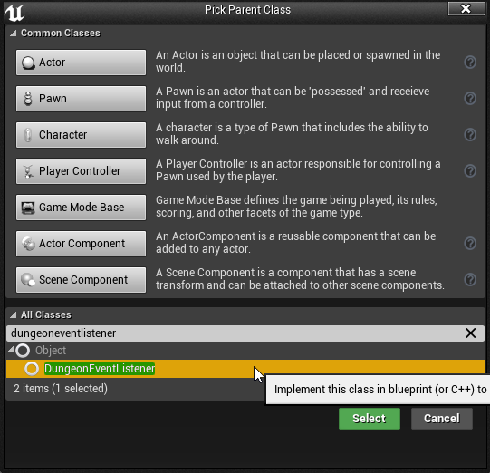
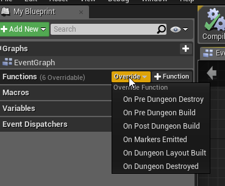
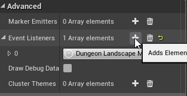
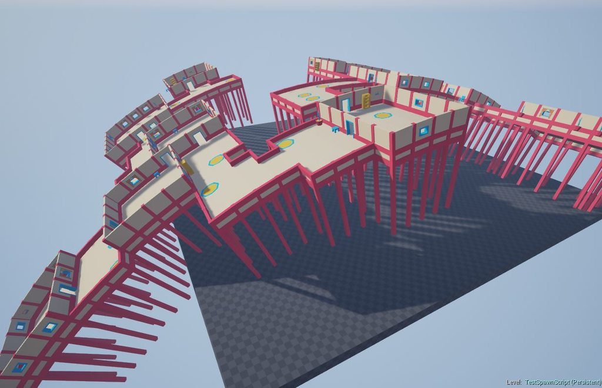

Event Listeners
===============

Event listeners are blueprints that get notified on various dungeon events. These are great for pre / post initializations

##Creation

Create a Event listener blueprint by choosing `DungeonEventListener` as the base class

Override any of the function events to get notified.  This function will be called by Dungeon Architect if your blueprint is registered with the Dungeon actor

##Registration
You need to register this blueprint with the dungeon actor to get its event notifications

Select the Dungeon Actor and Navigate to the `Advanced` category in the Details tab and choose your blueprint class

##Event Callbacks

Your blueprint can hook into various events of the dungeon build / destroy phase

###On Pre Dungeon Build

This is called before the dungeon is built

###On Dungeon Layout Built

This is called after the dungeon layout is built in memory.  At this stage, no markers are emitted on the scene and nothing is spawned.  However, the layout is available in the dungeon model if you'd like to view or modify it

###On Markers Emitted

This event is called after all the markers are emitted in the scene.   This event is also called right before the Theming engine is executed.    So this event gives you an oppertunity to modify the low markers themselves

This could be useful for automatically clamping dungeon items on a landscape or to apply some filter on the markers like the one shown below (see quick start guide for an example)

###On Post Dungeon Build
This is called after the dungeon is fully built

###On Pre Dungeon Destroy
This is called right before the dungeon is about to be destroyed

###On Dungeon Destroyed
This is called after the dungeon is fully destroyed

