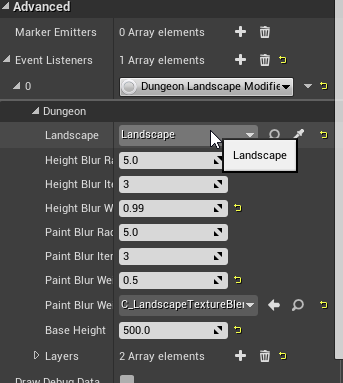
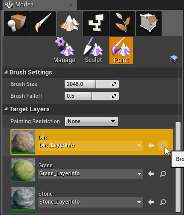

Landscape Transformer
=====================

Using the Landscape Transformer, you can modify a landscape's height and weights (textures) around the dungeon's layout

The landscape transformer is implemented as a event listener, so you'll need to register it in the Dungeon actor's event listener list under the Advanced category

After setting the landscape transformer, expand it and set the Landscape you'd wish to modify

Under the Layers array, add two entries

The first entry should be the Layer Info for filling the entire area
The second entry is for the inner path way.

You would have already created these layer info assets while creating the landscape and setting up the material

To find where you layer info is, Navigate to the Landscape tab > Paint section.  There you'd see entries for each layer that was defined in your material.   If you didn't create a layer info yet, create one or click the Find icon to find where it is.  Then assign the appropriate layer

YOUTUBE(9MI9IzNytuY)

