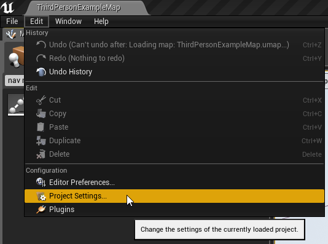

Navigation
==========

Unreal Engine supports runtime navigation generation.   However, a flag needs to be set in the projects setting.

Navigate to `Edit > Project Settings > Navgation Mesh > Runtime > Dynamic

This will automatically regenerate the navigation on runtime generated dungeons.  Be sure to have a `Nav Mesh bounds Volume` large enough to wrap the whole dungeon.  There is an example in the quick start guide to automatically wrap the navigation volume around a dungeon after it has been built.

YOUTUBE(uowWAVwEiEc)

